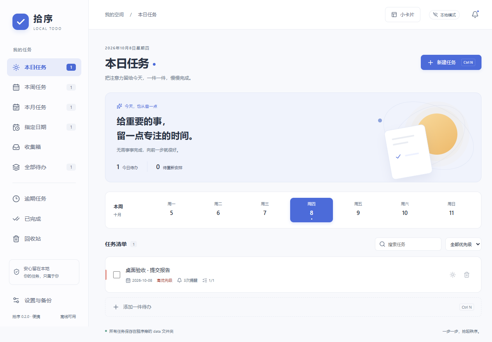

# 拾序 · LocalTodo 便携版

使用 Tauri 2、Rust、React/TypeScript 和 SQLite 的 Windows 本地任务程序。支持本日、本周、本月、指定日期任务、重复任务、截止提醒、子任务和备份恢复。

## 使用

当前交付为 **0.2.0 便携版**，无需安装。先解压[便携ZIP](portable/LocalTodo-0.2.0-windows-x64.zip)，然后双击`LocalTodo/local-todo.exe`。本工程可直接启动[便携程序](portable/LocalTodo/local-todo.exe)。发布说明见[portable-release.md](docs/portable-release.md)。

主界面右上角“小卡片”或托盘右键“桌面小卡片”打开常驻小卡片；也可运行`Open-Desktop-Card.cmd`直接启动卡片。顶部拖动区域可移动，边缘可调整大小，图钉按钮切换置顶并保存偏好。卡片支持切换今日/本周/逾期/全部，快速添加今日待办、勾选完成、点击任务打开主界面详情。两窗口实时同步。

- 新建任务：点击“新建任务”，或按 `Ctrl+N`。
- 安排到今天：只改变计划日期，不改变截止日期。
- 日/周/月视图共享任务，不会重复创建。
- 每月31日遇短月取月末，之后恢复原日号；每期独立完成。
- 提醒支持多个提前天数，`0` 表示当天；默认09:00。无截止日期时不能启用提醒。
- 关闭窗口后驻留托盘；托盘左键打开，右键提供新建和退出。主动退出后暂停提醒，下次启动合并补发。
- 系统通知是否显示由Windows通知权限和勿扰设置决定；提醒中心保留应用内记录。
- 删除的任务进入回收站，可恢复；恢复父任务不会自动取消子任务完成状态。
- 编辑重复任务时，可选择仅本次或本次及以后；修改重复规则需要选择后者。
- 在设置中切换主题、设置时区和登录启动、测试通知、导出JSON或SQLite快照。

数据库、设置、卡片偏好和WebView2缓存均位于**exe所在目录的`data`文件夹**：`data/todo.db`、`data/card.json`、`data/webview/`。路径与启动工作目录无关；移动时一起移动整个LocalTodo文件夹，先从托盘退出再复制。程序目录必须可写，不会回退到AppData。

便携版要求机器已有Microsoft Edge WebView2 Runtime；运行时无需网络。旧安装版及其AppData数据不会自动迁移或删除；已有任务可通过旧JSON备份在便携版设置中恢复。登录启动可选，移动文件夹后应在设置中重新关闭/开启登录启动，以更新Windows启动路径。

JSON恢复会替换当前任务和设置，恢复前会在数据库目录保存 `todo.before-restore-时间.db`。登录启动偏好保持当前状态；历史提醒不会在恢复时重新发送。SQLite快照用于人工灾难恢复，应用内恢复入口接受JSON。

## 开发与验证

依赖：Windows 10/11 x64、MSVC C++构建工具及Windows SDK、WebView2、Node.js 24、Rust 1.99.0（版本已锁定）。`scripts/env.ps1`优先使用工程内`.tools`工具链，也支持已有系统工具链。

```powershell
npm ci
./scripts/dev.ps1
./scripts/verify.ps1
./scripts/build.ps1
```

`scripts/build.ps1`仅构建便携EXE和ZIP，不运行安装器。ZIP从独立空白目录打包，不包含工作目录里的用户数据。

独立核心测试和性能测量：

```powershell
. ./scripts/env.ps1
cargo test -p todo-core
cargo run -p todo-core --example performance --release
```

真实桌面测试（不是浏览器模拟后端）：

```powershell
npm run tauri build -- --debug --no-bundle
./scripts/smoke.ps1
```

桌面测试通过WebView2 CDP操作真实程序与Rust/SQLite，数据放在`.tools/smoke-时间/`。仅调试构建在设置`LOCALTODO_TEST_DATA_DIR`时启用本地调试端口；正式构建不包含此入口。请勿同时运行两个桌面测试实例。

## 代码结构

- `crates/todo-core`：日期/重复规则、SQLite事务、提醒队列、备份恢复；不依赖GUI。
- `src-tauri`：Windows托盘、单实例、系统通知、登录启动和文件选择对话框。
- `src`：中文界面、任务详情、设置、提醒中心与交互测试。
- `docs`：已确认方案、开发记录、验收结果与界面截图。

首版不包含云同步、独立Windows服务或通知点击跳转；关机/主动退出时不发送提醒。已通过21项Rust测试、17项前端测试和18项真实桌面检查；本机安装、关闭驻留、单实例及通知提交通过。公开分发前仍需完成干净Windows 10/11机器、真实睡眠恢复、通知关闭/勿扰、登录启动及含大量数据的跨版本升级验收，详见[acceptance.md](docs/acceptance.md)。

界面截图：



便携发布版检查（先从托盘退出当前实例再执行）：`./scripts/portable-smoke.ps1`。该脚本在检查完成后保留程序运行；原生确认测试通过Windows UI Automation按按钮。数据库指纹辅助脚本需要可用的Python3与sqlite3，日常开发和构建无需Python。


主界面不显示右键菜单；小卡片右键可完成/编辑/移入回收站，也可快速添加、切换置顶、刷新、打开主界面或隐藏卡片，不包含调试菜单。
