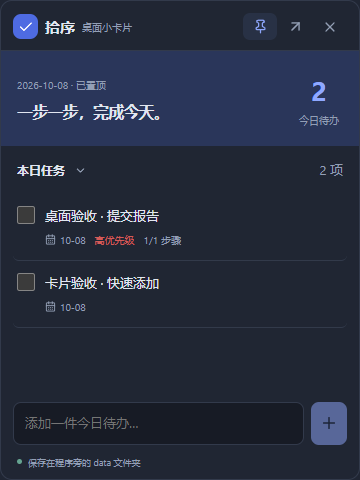

# 拾序0.2.0便携版交付

日期：2026-10-08；Windows x64；当前交付无需安装，默认启动桌面主界面。

## 程序与入口

- EXE：`D:\GithubProgram\AI\TodoList\portable\LocalTodo\local-todo.exe`。
- ZIP：`D:\GithubProgram\AI\TodoList\portable\LocalTodo-0.2.0-windows-x64.zip`，先解压整个文件夹再运行。
- 卡片启动：双击同目录`Open-Desktop-Card.cmd`，或执行`local-todo.exe --card`。
- 界面入口：主界面右上角“小卡片”，托盘右键“桌面小卡片”。

小卡片默认360×480，可拖动顶部与调整边缘大小；图钉切换置顶并记住选择。支持今日/本周/逾期/全部，快速添加今日截止任务、完成任务、点击标题打开主界面详情。关闭卡片只隐藏，后台提醒继续运行。

## 数据位置

exe旁的`data/todo.db`保存任务与设置，`data/card.json`保存置顶偏好，`data/webview/`保存WebView2缓存。与启动工作目录无关。整体移动便携文件夹即可携带数据；复制前请从托盘退出。

发布ZIP含程序、卡片入口、说明及空data目录；不会包含工作目录已有的用户数据。重新构建也不会清空已有data目录。程序目录不可写时明确报错，不会悄悄改用AppData。

旧安装版及其数据保留，不自动迁移。需要时从已有JSON备份在便携版设置中恢复。机器需已有WebView2 Runtime；日常运行无需联网。启用了登录启动后再移动程序目录，应重新关闭/开启该设置以更新系统路径。

## 验证

- Rust21项、前端14项通过；fmt、workspace全目标Clippy、TypeScript与Vite生产构建通过。
- 真实WebView2/Rust/SQLite双窗口操作14项通过，包含任务同步、卡片编辑入口、置顶偏好与隐藏重开。
- 便携发布版Windows UI Automation检查通过：原生WS_EX_TOPMOST标志置顶/取消、置顶保存至data、隐藏重开、第二进程退出。
- 从系统临时目录启动仍把数据库和缓存写到exe/data；实际WebView2进程user-data-dir核对通过。
- EXE与release完全一致；ZIP内exe也完全一致，且无任何数据库、测试任务或缓存。

证据：desktop-smoke-results.json、portable-smoke-results.json、portable-release-verification.json。干净Windows10/11、真实睡眠恢复/勿扰与注销后登录启动仍待独立系统验收。

ZIP大小：4,682,367字节；SHA-256：

```
87fd785bd67a99d2e78a083dc6244934a00cea949742beb1358158ecabce2782
```

EXE大小：14,438,912字节；SHA-256：

```
f2858e33be55d4748bcbb999778d608330a62c94931e33be16df72c8be3addf4
```



小卡片任务整行悬浮高亮已加入；浅色与深色主题均验证，包含复选框、标题、信息及行尾空白区域。便携EXE和ZIP同步更新。
